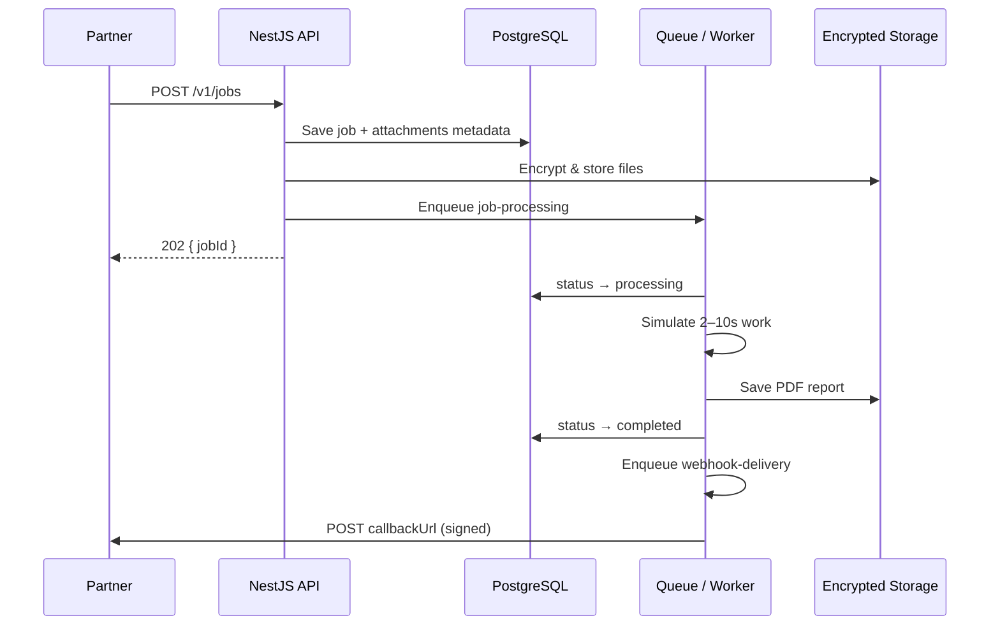

# Integration Gateway

A partner integration platform for submitting work items (metadata + file attachments), processing them asynchronously, and delivering a generated PDF report back via signed webhook and secure download link.

Built as a take-home case study: **Integration + Documents**.

See [Tech stack](#tech-stack) · [API endpoints](#api-endpoints) · [Architecture & workers](#architecture--queue--workers) · [What I'd do with more time](#what-id-do-with-more-time)

---

## What is this project?

External partners integrate programmatically — they don't use our UI. This repo implements the **integration boundary**: the public API a third-party developer calls, plus the pipeline that turns their submission into a delivered report.

**Typical flow:**

1. Partner submits a **job** (`POST /v1/jobs`) with JSON metadata and one or more files (images/PDFs).
2. The API authenticates the partner, validates input, stores attachments encrypted, and returns `202 Accepted` with a `jobId`.
3. A background worker processes the job (simulated 2–10 s delay), generates a PDF report, and marks the job complete.
4. On completion, the system **POSTs a signed webhook** to the partner's `callbackUrl` and exposes a **short-lived download link** for the report.

**What's included:**

| Component | Description |
|-----------|-------------|
| **Backend API** | Job submission, status polling, secure downloads, webhook delivery with retries |
| **Developer Console** | View API key, monitor jobs, download reports, re-send webhooks |
| **API Playground** | Submit test jobs from the browser and watch status update live |
| **Webhook Inbox** | Demo receiver to inspect signed webhook payloads locally |

---

## Tech stack

| Layer | Technology | Role |
|-------|------------|------|
| **Backend API** | NestJS 10, TypeScript | REST API, auth, validation, orchestration |
| **Database** | PostgreSQL 17, TypeORM | Jobs, partners, attachments metadata, webhook delivery records |
| **Queue / workers** | BullMQ + Redis *(optional)* | Async job processing and webhook delivery |
| **Local dev queue** | In-process (`LOCAL_QUEUE=true`) | Same logic without Redis — `setImmediate` / `setTimeout` |
| **File storage** | Local disk + AES-256-GCM | Encrypted attachments and PDF reports at rest |
| **PDF generation** | PDFKit | Report with metadata + optional image preview |
| **Auth** | Bearer API key + bcrypt | Partner authentication on all protected routes |
| **Frontend** | React 19, Vite, Tailwind CSS | Developer Console, Playground, Webhook Inbox |
| **Data fetching (UI)** | TanStack React Query | Live job polling and cache invalidation |
| **Testing** | Jest | Unit tests for webhook retry and delivery logic |

---

## API endpoints

Base URL: `http://localhost:3000`

All `/v1/*` partner routes use the global prefix. Auth header (where required):

```
Authorization: Bearer <api_key>
```

### Partner API (authenticated)

| Method | Endpoint | Auth | Description |
|--------|----------|------|-------------|
| `POST` | `/v1/jobs` | API key | Submit job (multipart: `metadata` + `files`). Returns `202`. |
| `GET` | `/v1/jobs` | API key | List all jobs for the authenticated partner. |
| `GET` | `/v1/jobs/:id` | API key | Poll job status, metadata, attachments, and result. |
| `GET` | `/v1/jobs/:id/report-url` | API key | Generate a fresh signed download URL for the report. |
| `POST` | `/v1/jobs/:id/webhook/retry` | API key | Re-queue webhook delivery for a completed job. |
| `GET` | `/v1/console/me` | API key | Partner info and API key (Developer Console). |

### Downloads (signed token — no API key)

| Method | Endpoint | Auth | Description |
|--------|----------|------|-------------|
| `GET` | `/v1/jobs/:id/report?token=…&expires=…` | HMAC token | Download PDF report (15 min TTL). |

### Demo / ops (no auth)

| Method | Endpoint | Description |
|--------|----------|-------------|
| `GET` | `/health` | Health check — DB and queue mode status. |
| `POST` | `/v1/demo/webhook-receiver` | Demo webhook target (records payloads for Webhook Inbox). |
| `GET` | `/v1/demo/webhook-inbox` | Last 20 webhook deliveries received by the demo receiver. |

### Outbound (we call the partner)

| Method | Target | Description |
|--------|--------|-------------|
| `POST` | Partner's `callbackUrl` | Signed webhook on job completion (`X-Webhook-Signature`, `X-Webhook-Event-Id`). |

See [API contract](#api-contract) below for request/response shapes, error codes, and webhook verification.

---

## Architecture & queue / workers

Processing is **off the HTTP request thread**. When a job is accepted, the API persists it to Postgres, encrypts attachments to disk, commits the transaction, then enqueues work — the HTTP response returns immediately with `202 Accepted`.



### Two async pipelines

| Queue | Job name | Trigger | Worker action |
|-------|----------|---------|-----------------|
| `job-processing` | `process-job` | Job accepted | Simulate processing → generate PDF → mark completed → enqueue webhook |
| `webhook-delivery` | `deliver-webhook` | Job completed (or manual retry) | POST signed payload to partner URL → retry on failure |

**Job lifecycle:** `accepted` → `processing` → `completed` | `failed`

**Webhook delivery lifecycle:** `pending` → `delivered` | `failed` (retrying) → `dead_letter` (after 7 attempts)

### How workers run (two modes)

**Local mode** (`LOCAL_QUEUE=true` — default for dev):

- No Redis required.
- `QueueDispatcher` runs workers in the same Node process:
  - Job processing → `setImmediate()` → `JobsService.processJob()`
  - Webhook delivery → `setTimeout(delay)` → `JobsService.deliverWebhook()`
- Good for demos and local development. Jobs in flight are lost on process restart.

**Production mode** (`LOCAL_QUEUE=false` + `REDIS_URL`):

- BullMQ workers backed by Redis.
- `JobProcessingProcessor` and `WebhookDeliveryProcessor` consume from separate queues.
- Supports delayed retries (`delay` option on webhook queue), horizontal scaling, and durability across restarts.

### Key backend modules

```
backend/src/
├── jobs/           Submission API, validation, idempotency, processJob(), deliverWebhook()
├── queue/          QueueDispatcher + BullMQ processors
├── storage/        AES-256-GCM encryption, read/write encrypted blobs
├── pdf/            PDF report generation
├── webhooks/       Payload building, HMAC signing, delivery records
├── downloads/      Signed URL generation and token verification
├── auth/           API key guard (bcrypt)
└── console/        Developer Console API + health check
```

---

## How to run it

### Prerequisites

- Node.js 20+
- PostgreSQL 17+

Redis is optional — local dev runs without it (`LOCAL_QUEUE=true`).

### Step 1 — Create the database (one-time)

```powershell
$env:PGPASSWORD = "YOUR_POSTGRES_PASSWORD"
& "C:\Program Files\PostgreSQL\17\bin\psql.exe" -U postgres -f scripts/init-postgres.sql
```

Or use the helper script:

```powershell
powershell -ExecutionPolicy Bypass -File scripts/run-local.ps1 -PostgresPassword "YOUR_POSTGRES_PASSWORD"
```

### Step 2 — Configure the backend

```powershell
copy backend\.env.example backend\.env
```

The defaults in `.env.example` work out of the box for local development. No edits required unless your Postgres credentials differ from `gateway:gateway@localhost:5432/integration_gateway`.

### Step 3 — Install dependencies and start

From the project root:

```powershell
npm install
npm run dev
```

This starts both services concurrently:

| Service | URL |
|---------|-----|
| **Developer Console** | http://localhost:5173 |
| **API** | http://localhost:3000 |
| **Health check** | http://localhost:3000/health |

**Demo API key:** `igw_demo_local_dev_key_12345`

### Step 4 — Try it

1. Open http://localhost:5173
2. Go to **Playground**, upload a file, and click **Submit job**
3. Watch the job move from `accepted` → `processing` → `completed`
4. Download the PDF report or check **Webhooks** for the signed delivery payload

### Run tests

```powershell
cd backend
npm test
```

### Run backend or frontend separately

```powershell
npm run dev:backend    # API only  → http://localhost:3000
npm run dev:frontend   # UI only   → http://localhost:5173
```

### Optional: Redis queue

By default, `LOCAL_QUEUE=true` in `backend/.env` runs workers in-process (no Redis). For BullMQ + Redis:

```env
LOCAL_QUEUE=false
REDIS_URL=redis://localhost:6379
```

---

## Environment variables

| Variable | Purpose |
|----------|---------|
| `DATABASE_URL` | PostgreSQL connection string |
| `LOCAL_QUEUE=true` | In-process workers (no Redis) |
| `ENCRYPTION_KEY` | 64 hex chars — AES-256-GCM for attachments/reports |
| `WEBHOOK_SIGNING_SECRET` | HMAC secret for outbound webhooks |
| `DOWNLOAD_SIGNING_SECRET` | HMAC secret for report download URLs |
| `PUBLIC_API_URL` | Base URL embedded in download links |
| `DEMO_API_KEY` | Seeded partner API key for the console |

---

## API contract

All partner endpoints require:

```
Authorization: Bearer <api_key>
```

Errors return a machine-readable body:

```json
{
  "error": {
    "code": "VALIDATION_ERROR",
    "message": "Human-readable summary",
    "details": [
      { "field": "files[0]", "code": "FILE_TOO_LARGE", "message": "File exceeds 25 MB limit" }
    ]
  }
}
```

Common error codes: `UNAUTHORIZED` (401), `FORBIDDEN` (403), `VALIDATION_ERROR` (400), `IDEMPOTENCY_CONFLICT` (409), `JOB_NOT_FOUND` (404), `LINK_EXPIRED` (410).

### `POST /v1/jobs`

Submit a job for async processing.

**Content-Type:** `multipart/form-data`

| Part | Type | Required | Description |
|------|------|----------|-------------|
| `metadata` | JSON string | yes | Job metadata (see below) |
| `files` | binary (repeatable) | yes | 1–10 attachments |

**Headers:**

| Header | Required | Description |
|--------|----------|-------------|
| `Authorization` | yes | `Bearer <api_key>` |
| `Idempotency-Key` | recommended | Client-generated unique key per logical submission |

**Metadata fields:**

```json
{
  "callbackUrl": "https://partner.example/webhooks/jobs",
  "externalRef": "partner-ref-12345",
  "type": "verification"
}
```

**Validation:**

- Allowed file types: JPEG, PNG, WebP, PDF (validated by MIME and magic bytes)
- Max 25 MB per file, 100 MB total, max 10 files

**Response `202 Accepted`:**

```json
{
  "jobId": "550e8400-e29b-41d4-a716-446655440000",
  "status": "accepted",
  "statusUrl": "/v1/jobs/550e8400-e29b-41d4-a716-446655440000"
}
```

### `GET /v1/jobs`

List all jobs for the authenticated partner (newest first).

### `GET /v1/jobs/:id`

Poll job status.

**Response (completed example):**

```json
{
  "jobId": "...",
  "status": "completed",
  "metadata": { "callbackUrl": "...", "externalRef": "...", "type": "..." },
  "attachments": [{ "filename": "doc.pdf", "mimeType": "application/pdf", "size": 1024 }],
  "errorMessage": null,
  "result": {
    "downloadUrl": "http://localhost:3000/v1/jobs/<id>/report?token=...&expires=...",
    "expiresAt": "2026-06-19T12:30:00.000Z",
    "webhookDelivered": true
  },
  "createdAt": "...",
  "completedAt": "..."
}
```

**Job statuses:** `accepted` → `processing` → `completed` | `failed`

### `GET /v1/jobs/:id/report`

Download the generated PDF report. Authenticated via signed query params (no API key required).

| Query | Description |
|-------|-------------|
| `token` | HMAC-SHA256 signature |
| `expires` | Unix timestamp (default TTL: 15 minutes) |

Returns `410 LINK_EXPIRED` when expired, `403 FORBIDDEN` for invalid token.

### `POST /v1/jobs/:id/webhook/retry`

Re-queue webhook delivery for a completed job. Returns `{ deliveryId, eventId, status: "queued" }`.

### `GET /v1/console/me`

Returns partner info and API key (shown in Developer Console).

### Outbound webhook (we call the partner)

On job completion we `POST` to the partner's `callbackUrl`:

**Headers:**

```
Content-Type: application/json
X-Webhook-Signature: t=<unix_timestamp>,v1=<hmac_sha256_hex>
X-Webhook-Event-Id: <uuid>
```

**Body:**

```json
{
  "eventId": "unique-per-delivery",
  "event": "job.completed",
  "jobId": "...",
  "status": "completed",
  "externalRef": "...",
  "completedAt": "...",
  "result": {
    "downloadUrl": "...",
    "expiresAt": "..."
  }
}
```

**Partner verification:**

```typescript
const expected = createHmac('sha256', WEBHOOK_SIGNING_SECRET)
  .update(`${timestamp}.${JSON.stringify(body)}`)
  .digest('hex');
// Compare timing-safe with v1 from X-Webhook-Signature
```

---

## Idempotency design

Partners should send an `Idempotency-Key` header on every submission. Without it, network retries can create duplicate jobs.

**Mechanism:**

1. Client generates a stable key per logical submission (e.g. UUID derived from their internal request ID).
2. Server looks up `(partnerId, idempotencyKey)` before creating a job.
3. If a match exists:
   - Same payload (SHA-256 hash of metadata + file names, MIME types, sizes, and contents) → return the existing job (`202` with same `jobId`).
   - Different payload → `409 IDEMPOTENCY_CONFLICT`.
4. A partial unique index on `(partner_id, idempotency_key)` prevents race-condition duplicates at the database level.

**Payload hash** covers metadata JSON and all file buffers so a key cannot be reused to silently change attachments.

---

## Webhook retry and dead-letter design

Delivery is **at-least-once**. Partners must deduplicate on `eventId` (store processed IDs with a TTL ≥ your retry window).

**Retry schedule** (7 attempts total):

| Attempt | Delay before next try |
|---------|----------------------|
| 1 | immediate |
| 2 | 1 s |
| 3 | 2 s |
| 4 | 4 s |
| 5 | 8 s |
| 6 | 16 s |
| 7 | 32 s |

After attempt 7 fails, the delivery moves to **`dead_letter`** status. Partners can manually re-trigger via `POST /v1/jobs/:id/webhook/retry`, which creates a **new** delivery with a fresh `eventId`.

**Failure triggers:** HTTP non-2xx, network errors, or 5 s request timeout.

**Worker idempotency:** if a delivery is already `delivered`, subsequent worker runs no-op (safe under at-least-once queue semantics).

**Queue tradeoff:**

| Mode | Config | Pros | Cons |
|------|--------|------|------|
| In-process | `LOCAL_QUEUE=true` | Zero infra, easy demo | Not durable across restarts; single process |
| BullMQ + Redis | `LOCAL_QUEUE=false` | Durable, scalable workers | Requires Redis |

Job **processing** failures (~15% simulated) mark the job `failed` but are not auto-retried — only webhook delivery retries. Processing retry would be a natural next step.

---

## Storage and security

- **API keys:** stored as bcrypt hashes; lookup by 8-char prefix.
- **Attachments & reports:** AES-256-GCM encrypted at rest on local disk (`backend/storage/`).
- **Download links:** HMAC-signed, 15-minute TTL — no permanent public URLs.
- **Webhooks:** HMAC-signed so partners can verify origin.

---

## Testing delivery and retry logic

**Approach:**

1. **Unit tests** mock `fetch` and repositories to assert status transitions (`delivered` → retry → `dead_letter`) without hitting real HTTP. See `backend/src/jobs/jobs.service.webhook-delivery.spec.ts`.
2. **Policy tests** verify backoff constants and signature format in `backend/src/webhooks/webhooks.service.spec.ts`.
3. **Manual / integration:** submit a job in the Playground with `callbackUrl` pointing at `http://localhost:3000/v1/demo/webhook-receiver`, then inspect the Webhook Inbox tab. Stop the receiver or return 500 to observe retries in job delivery status.

Run unit tests:

```powershell
cd backend
npm test
```

---

## What I'd do with more time

This submission is a working slice focused on the integration boundary, data integrity, and delivery semantics. With more time, I'd prioritize the following — roughly in order of production impact:

### Reliability & processing

- **Job processing retries:** today only webhook delivery retries; failed jobs (~15% simulated) go straight to `failed`. I'd add a separate retry queue with exponential backoff and a processing dead-letter queue, mirroring the webhook pattern.
- **Transactional outbox:** enqueue work via an outbox table in the same DB transaction as job creation, so a crash after commit never loses a queued job.
- **Idempotency hardening:** require `Idempotency-Key` in production (return `400` if missing) and add a TTL on stored keys to bound table growth.

### Partner experience & onboarding

- **Self-service partner registration:** API key issuance, rotation, and revocation — not just a demo key seeded from env.
- **Callback URL management:** allow partners to register/verify webhook endpoints (challenge/response) before accepting jobs.
- **Webhook replay & manual retry UI:** surface delivery attempt history, response codes, and dead-letter status in the Developer Console (partially stubbed today via `webhookDelivered` flag).

### Infrastructure & scale

- **Object storage:** move encrypted blobs to S3/GCS with SSE-KMS; generate pre-signed download URLs instead of serving files through the API process.
- **Horizontal workers:** separate API and worker deployments; scale BullMQ consumers independently; use Redis Cluster for HA.
- **Rate limiting & quotas:** per-partner submission rate limits, concurrent job caps, and payload quotas at the API gateway layer.

### Security

- **Webhook replay protection:** enforce timestamp tolerance (e.g. reject signatures older than 5 minutes) and optionally store seen `eventId` values.
- **Attachment scanning:** integrate ClamAV or a cloud AV API before processing untrusted uploads.
- **Secrets management:** Vault or cloud KMS for encryption keys and signing secrets instead of flat `.env` files.
- **Audit log:** immutable record of job submissions, status changes, and webhook delivery attempts for compliance.

### Observability & operations

- **Structured logging:** correlation IDs from submission through processing to webhook delivery.
- **OpenTelemetry:** distributed traces across API → queue → worker → outbound webhook.
- **Dashboards & alerts:** webhook dead-letter rate, processing latency p99, queue depth, failed job count.
- **Admin tooling:** replay dead-letter webhooks, reprocess failed jobs, inspect encrypted storage metadata without decrypting content.

### Testing & quality

- **E2E test suite:** supertest flow covering submit → poll → download → webhook receipt, plus idempotency conflict scenarios.
- **Contract tests:** publish an OpenAPI spec; validate partner integrations against it in CI.
- **Chaos / failure injection:** test webhook retry and dead-letter paths under simulated network partitions and slow partner endpoints (unit tests cover the happy-path transitions today; I'd add integration coverage).

### Product & document processing

- **Richer PDF reports:** embed first page of PDF attachments (today only image previews), watermarks, and partner branding.
- **Multiple report formats:** JSON result payload alongside PDF for partners who prefer structured data.
- **Job cancellation:** allow partners to cancel jobs still in `accepted`/`processing` state.

---

## Project structure

```
backend/          NestJS API, workers, encryption, PDF generation
frontend/         React Developer Console + Playground
scripts/          Postgres init and local setup helpers
```
